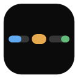
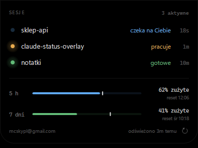
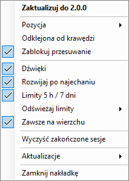

# Claude Status Overlay

## [⬇&nbsp; Pobierz instalator](https://github.com/mcskypl/claude-status-overlay/releases/latest)

Tyle zajmuje na ekranie. 148 × 5 px, zawsze na wierzchu, nigdy w drodze.

 

## Trzy poziomy szczegółu

Nakładka rośnie dokładnie wtedy, kiedy jej potrzebujesz — i sama wraca do cienkiej linii.

<table>
<tr>
<td width="50%" valign="top">

**Najedź myszką → pasek**

Stan, czas i oba liczniki w jednej linii.

</td>
<td width="50%" valign="top">

**Kliknij → panel**

Wszystkie sesje naraz: projekt, stan, jak dawno. Klik w wiersz przełącza na okno edytora tej sesji.

</td>
</tr>
</table>

Biała kreska na pasku limitu pokazuje, **ile z okna czasowego już minęło**. Wypełnienie przed kreską = palisz limit wolniej, niż leci czas. Za kreską = szybciej, niż powinieneś.

 

## Instalacja

1. **[Pobierz `ClaudeStatusOverlay-Setup.exe`](https://github.com/mcskypl/claude-status-overlay/releases/latest)** i uruchom.
2. Kreator pyta tylko o autostart. **Bez uprawnień administratora**, bez pytania o katalog.
3. **Zamknij i otwórz na nowo sesje Claude Code** — nakładka podpina się do nich przez hooki, które ładują się przy starcie sesji.

To wszystko. Instalator sam dopisuje hooki do `settings.json` (robiąc wcześniej kopię zapasową) i sam dociąga .NET Desktop Runtime 10, jeśli go nie masz.

> Wolisz bez instalatora? W każdym wydaniu jest też `...-portable.zip`.

 

## Aktualizuje się sama

Gdy pojawi się nowa wersja, nakładka daje znać — jeden klik i po sprawie: pobiera, podmienia, wraca na swoje miejsce razem z Twoimi ustawieniami.

Pod prawym przyciskiem siedzi cała reszta: pozycja przy dowolnej krawędzi lub rogu, blokada przesuwania, dźwięki, częstotliwość odświeżania limitów, „zawsze na wierzchu".

 

## Wymagania

- **Windows 10 lub 11** (64-bit)
- **[Claude Code](https://claude.com/claude-code)** — w terminalu, VS Code, JetBrains, obojętnie
- .NET Desktop Runtime 10 — *instalator zainstaluje go za Ciebie, jeśli trzeba*

## Prywatność

Nakładka nie ma serwera, konta ani telemetrii. Wychodzi z Twojego komputera tylko po dwie rzeczy, obie do wyłączenia jednym kliknięciem w menu:

- **limity** — `api.anthropic.com`, tym samym tokenem, którego już używa Claude Code (tylko do odczytu),
- **aktualizacje** — publiczne API GitHuba, raz na dobę, bez żadnych danych o Tobie.

 

---

### Podoba się?

Nakładka jest darmowa i będzie. Jeśli oszczędziła Ci choć trochę czasu — postaw kawę:

A jeśli nie — zostaw ⭐ na repo, to też pomaga.

 

**[⬇ Pobierz](https://github.com/mcskypl/claude-status-overlay/releases/latest)** · **[Zgłoś problem](https://github.com/mcskypl/claude-status-overlay/issues)** · **[Dokumentacja techniczna](docs/dokumentacja.md)**

